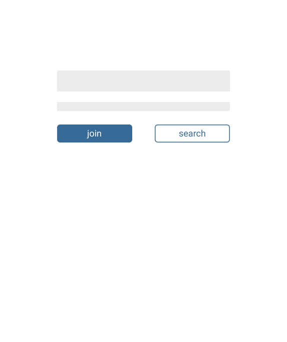
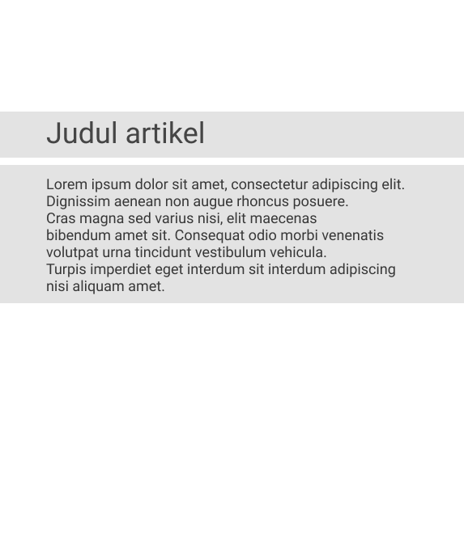
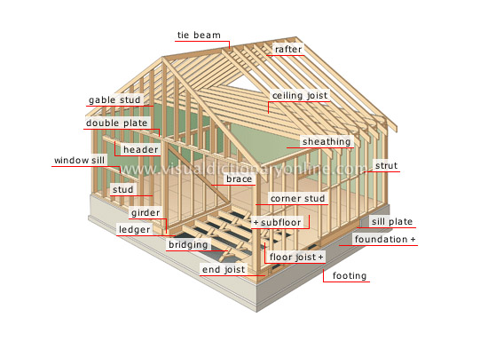

<!-- _class: invert -->
 
## Web Design and
## Basic of HTML & CSS
---
## Web Design
Apa yang orang lihat pertama kali ketika mengunjungi sebuah Web

---
<!-- _class: invert -->
#### Tidak bisa sembarang design
Jika kita ingin memberikan pengalaman yang lebih baik kepada pengunjung, hal yang paling utama adalah perhatikan desain kita

---
#### Desain yang bagus
Desain yang bagus adalah desain yang bisa memadukan antara komponen, kerapihan, dan warna. Warna yang bagus tapi tidak rapi juga berpengaruh besar.

---
#### Akan tetapi...
Semua desain kembali pada selera orang masing-masing. Ada yang bilang bagus, ada yang tidak. Namun kalau bisa kita buat yang bilang bagus > yang bilang tidak.

---
### Rule of web design
Rule di bawah ini adalah rule yang digunakan secara umum. Perbedaan rule pasti ada, dan itu menyesuaikan dari jenis web yang sedang kita buat

---
<!-- _class: invert -->
#### Elemen utama

Jika ada elemen utama, pastikan lebih menonjol dari yang lain

---
<!-- _class: invert -->
#### Keep it simple

Jangan terlalu banyak elemen yang tidak perlu

---
<!-- _class: invert -->
#### Konsisten

Selalu perhatikan desain yang konsisten. Kurang penggunaan elemen yang berbeda-beda

---
<!-- _class: invert -->
#### Pilih warna

Cari referensi perpaduan warna yang sesuai

---
<!-- _class: invert -->
#### Harus seimbang

Tiap elemen harus seimbang satu sama lainnya

---

# HTML
Hypertext Markup Language

---
**HTML** merupakan sebuah bahasa markup yang biasa digunakan dalam membuat dokumen web.
Jadi web itu ya sebuah dokumen.

---
#### HTML bukan bahasa pemrograman
Sesuai dengan namanya, HTML adalah bahasa markup, bukan bahasa pemrograman.
Apa itu bahasa markup?

---
<!-- _class: invert -->
## Bahasa Markup

Sederhananya, bahasa markup adalah sebuah dokumen yang isinya memiliki penanda-penanda khusus.

---
## Penanda Markup
Nah penanda-penanda markup di HTML disebut dengan sebutan **TAG**

---
## Tag HTML
HTML memiliki puluhan tag yang bisa digunakan. Secara garis besarnya dikelompokan menjadi dua tipe, yaitu block tag dan inline tag

---
#### Block tag HTML
Block tag HTML adalah sebuah tag yang akan mengambil space atau jarak secara penuh.

#### Inline tag HTML
Sedangkan inline tag bisa disejajarkan dengan tag-tag lainnya.

---
## Struktur HTML

```html
<!DOCTYPE html>
<html>
  <head>
    <title>Title of the document</title>
    <!-- css -->
  </head>

  <body>
    The content of the document......

    <!-- Footer dan script js -->
  </body>
</html>
```

---
<!-- _class: invert -->
## Struktur tag HTML
Struktur tag html sangat sederhana. Hanya seperti di bawah ini
```html
<namatag>konten</namatag>
```
Konten juga bisa berisi dengan tag lain.

---
<!-- _class: invert -->
## Struktur tag HTML
Akan tetapi, di dalam struktur tag html bisa kita tambahkan yang namanya atribut. Atribut adalah sebuah pengaturan khusus yang dipasang di tag html tersebut.
```html
<namatag namaatribut="valueatributnya">konten</namatag>
```
---
<!-- _class: invert -->
## Struktur tag HTML
Dalam satu tag, bisa diisi dengan atribut sebanyak yang dibutuhkan. Namun ada beberapa tag yang harus memiliki atribut wajib.

---
## Struktur tag HTML
Semua penulisan namatag dan namaatribut tidak boleh pake spasi (beberapa atribut bisa pake -). Tapi valuestributnya nya bebas, asalkan didalam tanda petik (").

---
## CLASS HTML
Class merupakan suatu atribut yang biasa menyimpan data-data style dari css

---
<!-- _class: invert -->
## Responsivitas
Tambahkan kode ini di dalam head
```html
<meta name="viewport" content="width=device-width, initial-scale=1">
```

---
## Macam-macam tag HTML
https://www.w3schools.com/html

---

## CSS
Cascading Style Sheets

---
**CSS** adalah sebuah file yang mengatur semua style dari halaman web.

---
<!-- _class: invert -->
Ibaratnya tuh HTML kerangka rumah, CSS itu warna dinding, dan semua yang mengatur desain dan keindahan dari rumah tersebut.
<br>


---
<!-- _class: invert -->
## Struktur CSS
Struktur CSS didefinisikan dengan
```css
.namaclass {
  atribut: value,
}

#namaid {
  atribut: value,
}

elemen {
  atribut: value,
}
```

---
## Macam-macam fungsi CSS
https://www.w3schools.com/css

---
## Integrasi dengan HTML
Cara untuk mengintegrasikan CSS dengan HTML ada tiga cara

---
##### Inline method
Yaitu dengan cara langsung memasangnya di elemen yang akan dihias dengan menggunakan atribut `style`

```html
<span style="color: red">Hello Guys, teks ini berwarna merah</span>
```

---
##### Dalam satu file dengan HTML
Diletakan pada tag `<style>` dan di letakan di dalam bagian `<head>`

```html
<head>
  <style>
    /* Isi CSS */
  </style>
</head>
```

---

##### Di file terpisah, dan diimport
Diimport di dalam `<head>`

```html
<head>
  <link rel="stylesheet" href="/path/css.css">
</head>
```

---
##### Penerapan dengan class
```css
/* Di css nya */
.text-red {
  color: "red",
}
```

```html
<!-- Di HTML nya -->
<span class="text-red">Teksnya berwarna merah</span>
```

---
## Framework CSS
Framework css adalah css buatan orang lain, kita tinggal import, pake class dan desainnya.

---
<!-- _class: invert -->
## Terima Kasih
Khoerul Umam


